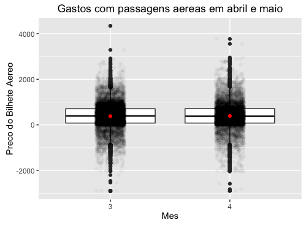

```{r, message=FALSE, warning=FALSE}
library(ggplot2)
library(dplyr)
ano.atual <- read.csv("~/Documents/workspace/AD1/problema1/dados/ano-atual.csv")
cota.estado <- read.csv("~/Documents/workspace/AD1/problema1/dados/valor-cota-por-estado.csv")
names(cota.estado) <- c("sgUF", "sum")

```

## Introdução
No problema 1 da disciplina Análise de Dados 1 pede para ser feita uma análise sobre os dados coletados do site de transparência da câmara dos deputados. Esses dados contém todos os gastos de nossos deputados em 2016 usando a sua cota para exercício da atividade parlamentar.
Nesse trabalho pretendo responder duas perguntar iniciais que levarão à formulação de mais duas perguntas.


##Pergunta 1: Levando em conta os gastos de janeiro a maio há alguma despesa que teve um aumento ou redução de gastos considerável durante esse período?
####Entendendo os dados
Os dados que iremos precisar aqui são os equivalentes aos 5 primeiros meses do ano, trabalhar só com esses meses é melhor pois é esperado que os valores declarados para esses meses, em sua maioria, já foram computados.

```{r, fig.width=10, fig.height=5}
##filtrando para ter só os 5 primeiros meses
trimestre1 = ano.atual %>% filter(numMes < 6)
## Agrupando por mes e por tipo de despesa, e somando todos os gastos.
tri.sum = trimestre1 %>% group_by(numMes, txtDescricao) %>% summarize(sum = sum(vlrDocumento))

##Mapeando os números para o tipo de Mês.
tri.sum$numMes <- as.factor(tri.sum$numMes)
levels(tri.sum$numMes) <- c("Janeiro", "Fevereiro", "Marco", "Abril", "Maio")

ggplot(tri.sum,aes(x=factor(txtDescricao),y=sum/1000000, fill = factor(numMes))) +
  ylab("Gastos em Milhoes") + labs(x = "Tipo de gasto", fill = "Mes/2016") +
  geom_bar(position = "dodge", stat = "identity") +
  coord_flip()
```

Como pode ser visto há crescimento em todas as despesas até março, depois não há uma uniformidade no comportamento das despesas em relação aos meses, mas todos tiveram redução em Abril e no mês de Maio em alguns há redução enquanto em outros há aumento.

Uma possível explicação para isso é que há algum tipo de gasto trismestral para a maioria dos deputados.
Para investigarmos melhor vamos ver como a distribuição Emissões de bilhetes aéreos, que teve muita redução,  de Março para Abril se comporta.

```{r, echo=TRUE, fig.width=0.01, fig.height=.01}
gastosabrilmaio = ano.atual %>% filter((numMes == 4 | numMes == 3)
                                        & txtDescricao == "Emissão Bilhete Aéreo")
medias = gastosabrilmaio %>% 
  group_by(numMes) %>% 
  summarise(vlrDocumento = mean(vlrDocumento))

ggplot(gastosabrilmaio, mapping = aes(x = as.factor(numMes), y = vlrDocumento) ) +
  labs( y ="Preco do Bilhete Aereo", x= "Mes",
        title = "Gastos com passagens aereas em abril e maio") +
  geom_boxplot() +
  geom_point(position = position_jitter(width = 0.3), alpha = 0.03) +
  geom_point(data = medias, colour = "red", size = 1.5)

```

  

Como podemos ver, é muito semelhante a distribuição dos valores nos dois meses e a média e mediana encontram-se muito perto uma da outra o que faz nos constatar uma simetria nos dados, logo vamo ver a quantidade de emissões nos dois meses. Vamos então ver a quantidade de bilhetes emitidos em cada um dos meses.

```{r}
trimestre1 %>% count(numMes)
```

Como imaginado, a quantidade de bilhetes emitidos em março foi aproximadamente 16.6% maior que em fevereiro e abril. Mas porque tantas emissões de bilhetes? Talvez o número de sessões nesse mês foi maior.


##Pergunta 2: Qual estado economiza mais em relação a sua cota?
Ainda considerando os primeiros 5 meses do ano, aqui estão a média de gastos dos primeiros 5 meses onde cada ponto representa 1 deputados e o ponto vermelho é a cota daquele deputado no mês.

```{r}
## pergunta 2  Qual estado economiza mais em relação as cotas? 
deputados = ano.atual %>% filter(numMes<6) %>%
  group_by(sgUF, txNomeParlamentar) %>% summarize(sum = sum(vlrDocumento)/5)

estados = deputados %>% group_by(sgUF) %>% summarise(mean = mean(sum))

ggplot(deputados, mapping = aes(x = sgUF, y = sum))+
  geom_point(position = position_jitter(width = 0.2), alpha = 0.5, na.rm = TRUE)+
  geom_point(data = cota.estado, colour = "red", size = 1.5)+
  labs( y ="media de gasto mensal", x= "Estado")

```

Algo interessante é que vemos alguns deputados que gastam mais que suas cotas mensais, isso é possível? Mas enfim, vamos ver qual estado economiza mais, pegando a média dos gastos dos deputados vamos ver qual está mais abaixo da cota

```{r}
estados = deputados %>% group_by(sgUF) %>% summarise(sum = mean(sum))
estados = estados %>% filter(sgUF != "")
ggplot(estados, mapping = aes(x = sgUF, y = sum))+
  geom_point(position = position_jitter(width = 0.2), alpha = 0.5, na.rm = TRUE)+
  geom_point(data = cota.estado, colour = "red", size = 1.5)+
  labs( y ="Media de gasto mensal de todos os deputados", x= "Estado")


```

Olhando assim, vemos que Rio de Janeiro, Alagoas e Piauí são os que mais economizam, agora vamos ver em porcentagem em relação as cotas de cada estado.

```{r}
estados$pc = estados$sum/cota.estado$sum*100 
ggplot(estados, mapping = aes(x = sgUF, y = pc))+
  geom_bar(position = "dodge", stat = "identity")+
  labs( y ="Percentagem de cota gasta em média", x= "Estado")

```

Assim vemos que Alagoas é o estado que tem os deputados que economizam mais. Ou será os que trabalham menos?

